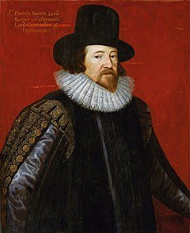

<table class="infobox vcard">
<tbody>
<tr>
<th colspan="2">

<a title="The Right Honourable" href="https://en.wikipedia.org/wiki/The_Right_Honourable">The Right Honourable</a>

 

The Viscount St. Alban

 

<a class="mw-redirect" title="Privy Counsellor (England)" href="https://en.wikipedia.org/wiki/Privy_Counsellor_(England)">PC</a>&nbsp;<a title="Queen's Counsel" href="https://en.wikipedia.org/wiki/Queen%27s_Counsel">QC</a>

</th>
</tr>
<tr>
<td colspan="2">

Portrait by&nbsp;<a class="mw-redirect" title="Pourbus the Younger" href="https://en.wikipedia.org/wiki/Pourbus_the_Younger">Pourbus the Younger</a>, 1617

</td>
</tr>
<tr>
<td colspan="2">&nbsp;</td>
</tr>
<tr>
<th colspan="2"><a title="Lord Chancellor" href="https://en.wikipedia.org/wiki/Lord_Chancellor">Lord High Chancellor of England</a></th>
</tr>
<tr>
<td colspan="2"><strong>In office</strong> 7&nbsp;March&nbsp;1617&nbsp;&ndash; 3&nbsp;May&nbsp;1621</td>
</tr>
<tr>
<th scope="row">Monarch</th>
<td><a class="mw-redirect" title="James I" href="https://en.wikipedia.org/wiki/James_I">James I</a></td>
</tr>
<tr>
<th scope="row">Preceded by</th>
<td><a class="mw-redirect" title="Sir Thomas Egerton" href="https://en.wikipedia.org/wiki/Sir_Thomas_Egerton">Sir Thomas Egerton</a></td>
</tr>
<tr>
<th scope="row">Succeeded by</th>
<td><a class="mw-redirect" title="John Williams, Bishop of Lincoln" href="https://en.wikipedia.org/wiki/John_Williams,_Bishop_of_Lincoln">John Williams</a></td>
</tr>
<tr>
<th colspan="2"><a class="mw-redirect" title="Attorney General of England and Wales" href="https://en.wikipedia.org/wiki/Attorney_General_of_England_and_Wales">Attorney General of England and Wales</a></th>
</tr>
<tr>
<td colspan="2"><strong>In office</strong> 26&nbsp;October&nbsp;1613&nbsp;&ndash; 7&nbsp;March&nbsp;1617</td>
</tr>
<tr>
<th scope="row">Monarch</th>
<td><a class="mw-redirect" title="James I" href="https://en.wikipedia.org/wiki/James_I">James I</a></td>
</tr>
<tr>
<th scope="row">Preceded by</th>
<td><a class="mw-redirect" title="Sir Henry Hobart" href="https://en.wikipedia.org/wiki/Sir_Henry_Hobart">Sir Henry Hobart</a></td>
</tr>
<tr>
<th scope="row">Succeeded by</th>
<td><a class="mw-redirect" title="Sir Henry Yelverton" href="https://en.wikipedia.org/wiki/Sir_Henry_Yelverton">Sir Henry Yelverton</a></td>
</tr>
<tr>
<th colspan="2">Personal details</th>
</tr>
<tr>
<th scope="row">Born</th>
<td>22 January 1561 <a title="Strand, London" href="https://en.wikipedia.org/wiki/Strand,_London">The Strand</a>, London, England</td>
</tr>
<tr>
<th scope="row">Died</th>
<td>9 April 1626&nbsp;(aged&nbsp;65) <a class="mw-redirect" title="Highgate, Middlesex" href="https://en.wikipedia.org/wiki/Highgate,_Middlesex">Highgate, Middlesex</a>, England</td>
</tr>
<tr>
<th>

Buried

</th>
<td>

<a class="mw-redirect" title="St. Michael's Church, St. Albans" href="https://en.wikipedia.org/wiki/St._Michael%27s_Church,_St._Albans">St. Michael's Church, St. Albans</a>

</td>
</tr>
<tr>
<th scope="row">Mother</th>
<td><a class="mw-redirect" title="Lady Anne Bacon" href="https://en.wikipedia.org/wiki/Lady_Anne_Bacon">Lady Anne Bacon</a></td>
</tr>
<tr>
<th scope="row">Father</th>
<td><a title="Nicholas Bacon (Lord Keeper)" href="https://en.wikipedia.org/wiki/Nicholas_Bacon_(Lord_Keeper)">Sir Nicholas Bacon</a></td>
</tr>
<tr>
<th scope="row"><a title="Alma mater" href="https://en.wikipedia.org/wiki/Alma_mater">Alma mater</a></th>
<td>

<ul>
<li><a title="University of Cambridge" href="https://en.wikipedia.org/wiki/University_of_Cambridge">University of Cambridge</a></li>
<li><a title="Trinity College, Cambridge" href="https://en.wikipedia.org/wiki/Trinity_College,_Cambridge">Trinity College, Cambridge</a></li>
<li><a title="University of Poitiers" href="https://en.wikipedia.org/wiki/University_of_Poitiers">University of Poitiers</a></li>
</ul>

</td>
</tr>
<tr>
<th scope="row">Notable work</th>
<td><a title="Works by Francis Bacon" href="https://en.wikipedia.org/wiki/Works_by_Francis_Bacon">Works by Francis Bacon</a></td>
</tr>
<tr>
<th scope="row">Signature</th>
<td></td>
</tr>
<tr>
<td colspan="2">
<strong>Philosophy career</strong></td>
</tr>
<tr>
<th scope="row">

Notable work

</th>
<td><em><a title="Novum Organum" href="https://en.wikipedia.org/wiki/Novum_Organum">Novum Organum</a></em></td>
</tr>
<tr>
<td colspan="2">&nbsp;</td>
</tr>
<tr>
<th scope="row">Era</th>
<td class="category"><a title="Renaissance philosophy" href="https://en.wikipedia.org/wiki/Renaissance_philosophy">Renaissance philosophy</a> <a title="17th-century philosophy" href="https://en.wikipedia.org/wiki/17th-century_philosophy">17th-century philosophy</a></td>
</tr>
<tr>
<th scope="row">Region</th>
<td class="category"><a title="Western philosophy" href="https://en.wikipedia.org/wiki/Western_philosophy">Western philosophy</a></td>
</tr>
<tr>
<th scope="row"><a title="List of schools of philosophy" href="https://en.wikipedia.org/wiki/List_of_schools_of_philosophy">School</a></th>
<td class="category"><a title="Empiricism" href="https://en.wikipedia.org/wiki/Empiricism">Empiricism</a></td>
</tr>
<tr>
<th scope="row">

Main interests

</th>
<td>

<ul>
<li><a title="Natural philosophy" href="https://en.wikipedia.org/wiki/Natural_philosophy">Natural philosophy</a></li>
<li><a title="Philosophical logic" href="https://en.wikipedia.org/wiki/Philosophical_logic">Philosophical logic</a></li>
</ul>

</td>
</tr>
<tr class="note">
<th scope="row">

Notable ideas

</th>
<td>

List<a id="NavToggle1" class="NavToggle" href="https://en.wikipedia.org/wiki/Francis_Bacon#">[hide]</a>

<ul class="NavContent">
<li>

<ul>
<li><a title="Baconian method" href="https://en.wikipedia.org/wiki/Baconian_method">Baconian method</a></li>
<li><em><a title="Idola fori" href="https://en.wikipedia.org/wiki/Idola_fori">Idola fori</a></em></li>
<li><em><a title="Idola theatri" href="https://en.wikipedia.org/wiki/Idola_theatri">Idola theatri</a></em></li>
<li><em><a title="Idola specus" href="https://en.wikipedia.org/wiki/Idola_specus">Idola specus</a></em></li>
<li><em><a title="Idola tribus" href="https://en.wikipedia.org/wiki/Idola_tribus">Idola tribus</a></em></li>
<li><a title="Salomon's House" href="https://en.wikipedia.org/wiki/Salomon%27s_House">Salomon's House</a></li>
</ul>

</li>
</ul>

</td>
</tr>
<tr class="note">
<td colspan="2">

Influences

<ul class="NavContent">
<li>

<a title="Aristotle" href="https://en.wikipedia.org/wiki/Aristotle">Aristotle</a>,&nbsp;<a title="Bernard Palissy" href="https://en.wikipedia.org/wiki/Bernard_Palissy">Palissy</a>,&nbsp;<a title="Bernardino Telesio" href="https://en.wikipedia.org/wiki/Bernardino_Telesio">Telesio</a>,&nbsp;<a title="Cicero" href="https://en.wikipedia.org/wiki/Cicero">Cicero</a>,&nbsp;<a title="Michel de Montaigne" href="https://en.wikipedia.org/wiki/Michel_de_Montaigne">Michel de Montaigne</a>,&nbsp;<a class="mw-redirect" title="Machiavelli" href="https://en.wikipedia.org/wiki/Machiavelli">Machiavelli</a>,&nbsp;<a title="Paracelsus" href="https://en.wikipedia.org/wiki/Paracelsus">Paracelsus</a>,&nbsp;<a title="Plato" href="https://en.wikipedia.org/wiki/Plato">Plato</a>,&nbsp;<a title="Roger Bacon" href="https://en.wikipedia.org/wiki/Roger_Bacon">Roger Bacon</a>,&nbsp;<a class="mw-redirect" title="Biringuccio" href="https://en.wikipedia.org/wiki/Biringuccio">Biringuccio</a>,&nbsp;<a class="mw-redirect" title="William Gilbert (astronomer)" href="https://en.wikipedia.org/wiki/William_Gilbert_(astronomer)">William&nbsp;Gilbert</a>

</li>
</ul>

</td>
</tr>
<tr class="note">
<td colspan="2">

Influenced

<ul class="NavContent">
<li>

<a title="Basil Montagu" href="https://en.wikipedia.org/wiki/Basil_Montagu">Basil Montagu</a>,&nbsp;<a title="Encyclop&eacute;distes" href="https://en.wikipedia.org/wiki/Encyclop%C3%A9distes">Encyclop&eacute;distes</a>,&nbsp;<a title="Isaac Newton" href="https://en.wikipedia.org/wiki/Isaac_Newton">Isaac Newton</a>,&nbsp;<a title="John Locke" href="https://en.wikipedia.org/wiki/John_Locke">John Locke</a>,&nbsp;<a title="Robert Boyle" href="https://en.wikipedia.org/wiki/Robert_Boyle">Robert Boyle</a>,&nbsp;<a title="Thomas Hobbes" href="https://en.wikipedia.org/wiki/Thomas_Hobbes">Thomas Hobbes</a>,&nbsp;<a title="Thomas Jefferson" href="https://en.wikipedia.org/wiki/Thomas_Jefferson">Thomas Jefferson</a>,&nbsp;<a title="Voltaire" href="https://en.wikipedia.org/wiki/Voltaire">Voltaire</a>,&nbsp;<a title="Jean-Jacques Rousseau" href="https://en.wikipedia.org/wiki/Jean-Jacques_Rousseau">Jean-Jacques Rousseau</a>,&nbsp;<a title="William Petty" href="https://en.wikipedia.org/wiki/William_Petty">William Petty</a>

</li>
</ul>

</td>
</tr>
</tbody>
</table>
 
<h2> Books </h2>
<ul>
  
 <li><a target="_blank" href="https://github.com/manjunath5496/Works-By-Francis-Bacon/blob/master/wfb(1).pdf" style="text-decoration:none;">History of Life and Death</a></li>
  
<li><a target="_blank" href="https://github.com/manjunath5496/Works-By-Francis-Bacon/blob/master/wfb(2).pdf" style="text-decoration:none;">New Atlantis</a></li>

<li><a target="_blank" href="https://github.com/manjunath5496/Works-By-Francis-Bacon/blob/master/wfb(3).pdf" style="text-decoration:none;">The Advancement of Learning </a></li>                         
  <li><a target="_blank" href="https://github.com/manjunath5496/Works-By-Francis-Bacon/blob/master/wfb(4).pdf" style="text-decoration:none;">The Essays of Francis Bacon</a></li>
  
 <li><a target="_blank" href="https://github.com/manjunath5496/Works-By-Francis-Bacon/blob/master/wfb(5).pdf" style="text-decoration:none;">The Great Instauration</a></li>  
 
   <li><a target="_blank" href="https://github.com/manjunath5496/Works-By-Francis-Bacon/blob/master/wfb(6).pdf" style="text-decoration:none;">Valerius Terminus : Of the Interpretation of Nature</a></li>  
                                             

 <li><a target="_blank" href="https://github.com/manjunath5496/Works-By-Francis-Bacon/blob/master/wfb(7).pdf" style="text-decoration:none;">Novum Organum; Or, True Suggestions for the Interpretation of Nature</a></li>
 
</ul>
